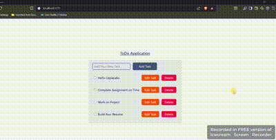

# Todo App using React Redux/Toolkit 📝

A simple and interactive Todo Application built with **React**, **Redux Toolkit**, and **Vite**.  
Manage your tasks efficiently with add, edit, delete, and complete features.

---

 

## Features

- Add new tasks
- Edit tasks
- Delete tasks
- Mark tasks as completed (line-through effect)
- Tasks are saved in **local storage**

---

## Tech Stack

- **Frontend:** React, JavaScript, HTML, CSS  
- **State Management:** Redux Toolkit  
- **Build Tool:** Vite  
- **Storage:** Local Storage

---

